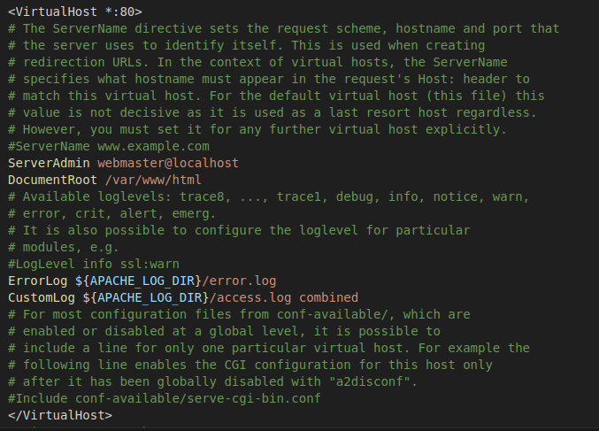

# SocialEngineeringToolkit
Social Engineering Toolkit


<hr>

```terminal
cd /etc/
```
```terminal
cd apache2/
```
```terminal
ls
```
output
```
apache2.conf    conf-enabled  magic           mods-enabled  sites-available
conf-available  envvars       mods-available  ports.conf    sites-enabled

```
```terminal
cd sites-enabled/
```
```
ls
```
output
```
000-default.conf  098-xplico.conf

```
Open and configure file
```terminal
nano 000-default.conf
```
<center>

</center>

# Let's to launch social engeneering app
1. Go  to Application (system linux)
2. pentesting
3. Outils d'exploitation
4. Social engeneering
5. Social engeneering toolkit

```
        ________________________
              __  ___/__  ____/__  __/
              _____ \__  __/  __  /
              ____/ /_  /___  _  /
              /____/ /_____/  /_/     

[---]        The Social-Engineer Toolkit (SET)         [---]
[---]        Created by: David Kennedy (ReL1K)         [---]
                      Version: 8.0.3
                    Codename: 'Maverick'
[---]        Follow us on Twitter: @TrustedSec         [---]
[---]        Follow me on Twitter: @HackingDave        [---]
[---]       Homepage: https://www.trustedsec.com       [---]
        Welcome to the Social-Engineer Toolkit (SET).
         The one stop shop for all of your SE needs.

   The Social-Engineer Toolkit is a product of TrustedSec.

           Visit: https://www.trustedsec.com

   It's easy to update using the PenTesters Framework! (PTF)
Visit https://github.com/trustedsec/ptf to update all your tools!


 Select from the menu:

   1) Social-Engineering Attacks
   2) Penetration Testing (Fast-Track)
   3) Third Party Modules
   4) Update the Social-Engineer Toolkit
   5) Update SET configuration
   6) Help, Credits, and About

  99) Exit the Social-Engineer Toolkit

set> 
```